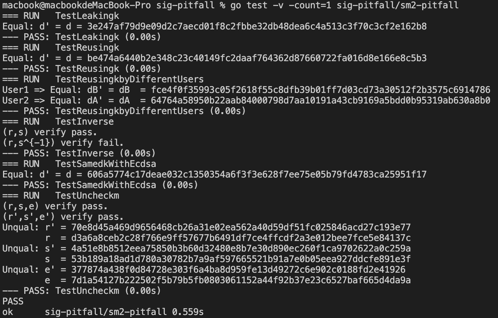

# Sig-pitfalls

## Use

Weak version of sm2/ecdsa sign and verify code are implemented in sm2pitfall.go/ecdsapitfall.go. In ``WeakSm2Sign`` and ``WeakEcdsaSign`` function, it allows user to use a given ``k``. In ``WeakEcdsaVerify`` function, the validation of ``s`` is not checked.

The proof-of-concept code is implemented in TestXxx func. We still use randomly generated k ``k, err := rand.Int(rand.Reader, N)``, but it's leaked to test function.

```go
go test -v -count=1 sig-pitfall/sm2-pitfall
go test -v -count=1 sig-pitfall/ecdsa-pitfall
```

## Result

Next we'll give a result of these tests. Note that because``k`` is still generated randomly, so the specific ``d,r,s,e`` will be different everytime.

### 1. Leaking k leads to leaking of d

```blank
sm2✅
=== RUN   TestLeakingk
Equal: d' = d = 70cda02bed3b5591505e6cf3367cdfffe8ad1ed15b0a449b4d34ce87c060c2bc

ecdsa✅
=== RUN   TestLeakingk
Equal: d' = d = 70cda02bed3b5591505e6cf3367cdfffe8ad1ed15b0a449b4d34ce87c060c2bc
```

### 2. Reusing k leads to leaking of d

- Ecdsa: When using the same `k`, `r` will be the same.

```blank
sm2✅
=== RUN   TestReusingk
Equal: d' = d = 7f8dca76c071d0ec7a11cbd48af5acb0c9ebef7647f02617f23c6c8b3b6234bf

ecdsa✅
=== RUN   TestReusingk
r1 = r2 = 70c542fcdb9215983b6dfe3374abf755ebbc203950c087ca7c3d3f89a47a9f67
Equal: d' = d = 2fc2b9904c50bd9d0711061af8473c21c398b1d1453a847049d8b3917f4f7cef
```

### 3. Two users, using k leads to leaking of d, that is they can deduce each other’s d

- Ecdsa: When using the same `k`, `r` will be the same.

```blank
sm2✅
=== RUN   TestReusingkbyDifferentUsers
User1 => Equal: dB' = dB  = 5912624f61b64dc0a3267dec2af2a35ca4b58453cd3539a510f23cd9d85a2e46
User2 => Equal: dA' = dA  = b9cb644cf459282b7c03629c9e3d77f6fcd946b7f74552c32ae7bd2b9c6c24d0

ecdsa✅
=== RUN   TestReusingkbyDifferentUsers
Equal: r1 = r2 = ce8a083fc8f14d32fd3f2ed933d5b41f8daec3efa33f652237ed1c8ab67d8e32
User1 => Equal: d' = d = ef3e7e7d39ebbd0952ea75c9fd4d36ffec3d31ee0179c5688c25c8807d7ecec8
User2 => Equal: d' = d = 45a903067c2e1fce598448355396f9b1a8bef37edb0d43532bd2c854a7250c61
```

### 4. Malleability, e.g. (r,s) and (r,-s) are both valid signatures, lead to blockchain network split

```blank
sm2❌
=== RUN   TestInverse
(r,s) verify pass.
(r,s^{-1}) verify fail.

ecdsa✅
=== RUN   TestInverse
(r,s) verify pass.
(r,s^{-1}) verify pass.
```

### 5. One can forge signature if the verification does not check m

```blank
sm2✅
=== RUN   TestUncheckm
(r,s,e) verify pass.
(r',s',e') verify pass.
Unqual: r' = cc6ee2a279f15c0e4d135c82fad160f477bb6f57ff6600bf5017f830753b3ba3
        r  = 3c0d2e07c7698461fc472f965a0348649f764aa991b00f95077590106bff638
Unqual: s' = 15c596f500d66410e50b44291dcd6b9334a9c5089b2554ee2f0c012c1e34c2df
        s  = 3c919d6c1e7b31be1fccddfac2f6afa91a2497f1794a83a8c5479c38112c7c2a
Unqual: e' = 953cda0a09e2301dd571d10b7d1cf498799c9b8ef08dd58a91db17ada20b2e89
        e  = 7d1a54127b222502f5b79b5fb0803061152a44f92b37e23c6527baf665d4da9a

ecdsa✅
=== RUN   TestUncheckm
(r,s,e) verify pass.
(r',s',e') verify pass.
Unqual: r' = 5024d7bc026c1b08caacc4fd5be65e4b62eefa697cf96ac1ffb230edfb69ab77
        r  = f4e69841dac0e274221df8a5b5f56c4b12d0948411fa23840f97f2fd07d4a304
Unqual: s' = d5cb9f5164bdc28b648b64a1940541f58b7ff772105fda77c6bddec06d2423dc
        s  = fc8b895488f73fc3b077037769c164eedc3721e76e725e209ffd7c60f3fb81bf
Unqual: e' = 5895dc90ebecb08126c774e2b00ad36f69ab824daace5aa39432f9b7668d6f50
        e  = 7d1a54127b222502f5b79b5fb0803061152a44f92b37e23c6527baf665d4da9a
```

### 6. Same d and k with ECDSA, leads to leaking of k

```blank
sm2✅
=== RUN   TestSamedkWithEcdsa
Equal: d' = d = c0ee3b953af30ebfd152be766abdf00d8d19a5ca0356e0a588445c58ff5a1939
```

## Result Figures



